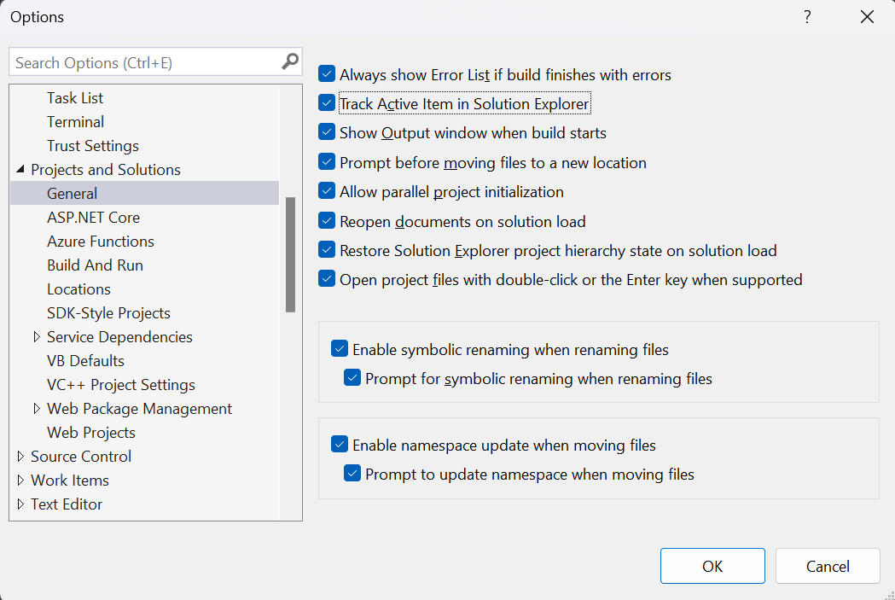

# Win Dev Setup

## Requirements

[Winget](https://learn.microsoft.com/en-us/windows/package-manager/winget/)

## Setup

After installing `winget`, follow the instructions below to configure your environment.

### Install software

Open a admin powershell and run:

```sh
./scripts/install.ps1
```

The script will install software that I use daily for development.

### Configure git

In a text editor open the script `scripts/git.ps1` and edit the following lines:

```powershell
git config --global user.name "Your name"
git config --global user.email "name@example.com"
```

After changing the values, run the script.

### Visual Studio

#### Recommended extensions for C#

- [CodeMaid]()
- [SonarLint]()
- [Roslynator]()
- [Productivity Power Tools]()

#### Settings

Open `Visual Studio` and navigate to `Debug > Windows > Exception Settings` and enable `Common Language Runtime Exceptions`. It should be partially enabled by default, but it is good to fully enable it. With this setting turned on, the debugger will always break whenever the code throws an exception.


Then go to `Tools > Options > Projects and Solutions` and check `Track Active Item in Solution Explorer` so when you open a file in the text editor it will be selected at the `Solution Explorer`. This is useful if you use shortcuts like `Quick Find (CTRL + F)` or `Go To All (CTRL + T)`.



> [2024-11-26] Recently I had some issues debugging a project on VS 2022. The issue I was facing was that the application was not starting when using the debugger (F5), no breakpoints were being reached and there was no exception (`Output Window` was clean as well). The way I fixed this was by disabling `Debug -> Options -> Just My Code`. After I disabled this setting, I could see there was an exception happening at the start of the process, and it was being thrown by external code, and that was the reason the service was not starting.

##### CodeMaid

`CodeMaid` removes modifiers like `required` from class properties. To fix this go to `Extensions > CodeMaid > Options > Cleaning > Insert` and uncheck `Insert explicit access modifiers on **properties**`.


To run `CodeMaid` cleanup on save, go to `Extensions > CodeMaid` and activate `Automatic Cleanup On Save` or press `CTRL + M, '`.
